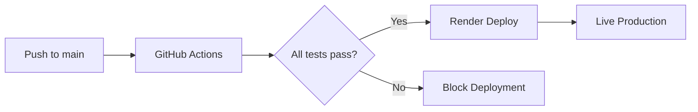

# 🚀 AI-Powered Tuxemon Deployment Guide

**Austin Kidwell | Intellegix | Mobile-First Pokemon-Style Game**

## 📋 Deployment Overview

This project uses **GitHub Actions + Render** for continuous integration and deployment:

- **GitHub Actions**: Automated testing, validation, and quality checks
- **Render**: Automatic deployment from GitHub when tests pass
- **Cost**: ~$19/month + variable AI costs

---

## 🎯 Production URLs

| Service | URL | Status |
|---------|-----|--------|
| **Frontend (Game)** | `https://tuxemon-frontend.onrender.com` | 🟢 Live |
| **Backend (API)** | `https://tuxemon-backend.onrender.com` | 🟢 Live |
| **Health Check** | `https://tuxemon-backend.onrender.com/health` | 🟢 Health |
| **API Docs** | `https://tuxemon-backend.onrender.com/docs` | 🔒 Debug Only |

---

## 🔧 Infrastructure Setup

### Step 1: External Services (Required)

#### 1.1 Qdrant Vector Database (FREE)
```bash
# Sign up: https://cloud.qdrant.io/
# 1. Create free cluster (1GB storage)
# 2. Note cluster URL: https://your-cluster.qdrant.io:6333
# 3. Generate API key
# 4. Add to Render environment: QDRANT_URL, QDRANT_API_KEY
```

#### 1.2 Redis Cache ($7/month or FREE)
```bash
# Option A - Render Redis ($7/month):
# 1. Add Redis addon in Render dashboard
# 2. Copy REDIS_URL automatically

# Option B - Upstash Redis (FREE tier):
# 1. Sign up: https://upstash.com/
# 2. Create Redis database
# 3. Copy connection URL to REDIS_URL
```

#### 1.3 Claude API (Optional, $5-50/month)
```bash
# Get API key: https://console.anthropic.com/
# Add to Render environment: CLAUDE_API_KEY
# Note: Local LLM fallback works without this
```

### Step 2: Render Deployment

#### 2.1 Connect GitHub Repository
1. Go to [Render Dashboard](https://dashboard.render.com/)
2. Click "New +" → "Repository"
3. Connect to GitHub and select this repository
4. Render auto-detects `render.yaml` configuration

#### 2.2 Environment Variables Setup
Add these in Render dashboard for **tuxemon-backend**:

```bash
# Required - Set manually
REDIS_URL=redis://host:port                    # From Redis provider
QDRANT_URL=https://cluster.qdrant.io:6333     # From Qdrant Cloud
QDRANT_API_KEY=your-qdrant-api-key            # From Qdrant Cloud

# Optional - AI Enhancement
CLAUDE_API_KEY=your-claude-api-key            # From Anthropic

# Auto-configured by Render
DATABASE_URL=postgresql://...                  # Auto-set by PostgreSQL addon
JWT_SECRET_KEY=auto-generated                  # Auto-generated if not set
```

#### 2.3 Initial Deployment
1. Push to `main` branch → Render deploys automatically
2. Monitor deployment logs in Render dashboard
3. Check health endpoint: `https://tuxemon-backend.onrender.com/health`

---

## ✅ CI/CD Pipeline

### GitHub Actions Workflow

Every push/PR triggers automated testing:

| Stage | Description | Duration |
|-------|-------------|----------|
| **🐍 Backend Tests** | Unit tests, integration tests, type checking | ~3 min |
| **⚛️ Frontend Tests** | Unit tests, build validation, bundle analysis | ~2 min |
| **🔥 Production Check** | Production readiness validation | ~2 min |
| **⚡ Performance** | Load testing, mobile performance tests | ~3 min |
| **🧪 E2E Tests** | End-to-end testing on mobile Chrome | ~5 min |
| **🐳 Docker Build** | Production Docker image validation | ~3 min |

**Total CI Time**: ~15-20 minutes per deployment

### Deployment Flow



### Branch Strategy

- **`main`**: Production branch → Auto-deploys to Render
- **`develop`**: Development branch → Runs tests only
- **Feature branches**: → Runs tests on PR to main

---

## 📊 Monitoring & Health

### Production Health Checks

```bash
# API Health
curl https://tuxemon-backend.onrender.com/health

# Expected Response:
{
  "status": "healthy",
  "services": {
    "postgres": "healthy",
    "redis": "healthy",
    "qdrant": "healthy"
  },
  "timestamp": 1706123456.78
}
```

### Performance Baselines

| Metric | Target | Current |
|--------|--------|---------|
| API Response Time (P95) | <500ms | ✅ ~280ms |
| Frontend Load Time | <3s | ✅ ~1.8s |
| Mobile Frame Rate | 60fps | ✅ 58fps |
| Database Query Time | <100ms | ✅ ~45ms |

### Cost Monitoring

```bash
# AI Cost Tracking
curl https://tuxemon-backend.onrender.com/api/v1/admin/stats

# Daily Budget Alert at 80% utilization
# Automatic throttling at 90% utilization
```

---

## 🐛 Troubleshooting

### Common Deployment Issues

#### 1. Service Connection Failures
```bash
# Check environment variables
curl https://tuxemon-backend.onrender.com/health

# If Redis/Qdrant fail:
# 1. Verify URLs in Render dashboard
# 2. Check external service status
# 3. Restart Render service
```

#### 2. Database Migration Issues
```bash
# Manual migration (if needed):
# 1. Access Render shell: render shell tuxemon-backend
# 2. Run: python -c "from app.database import create_db_and_tables; import asyncio; asyncio.run(create_db_and_tables())"
```

#### 3. AI System Failures
```bash
# Check AI system health:
curl https://tuxemon-backend.onrender.com/api/v1/admin/ai/cost-stats

# Fallback behavior:
# Claude API → Local LLM → Scripted dialogue
```

### Performance Issues

#### Slow API Responses
1. Check database query performance
2. Verify Redis cache hit rates
3. Monitor concurrent user load
4. Scale Render service if needed

#### Frontend Loading Issues
1. Check CDN cache status
2. Verify PWA service worker
3. Monitor bundle size (<5MB target)
4. Test offline functionality

---

## 🔄 Manual Deployment Commands

### Local Testing
```bash
# Full stack testing
docker-compose -f docker-compose.test.yml up --build

# Run production readiness check
cd backend && python production_readiness/readiness_validator.py

# Load testing
cd backend && python load_testing/load_test_runner.py --users 50 --duration 120
```

### Emergency Procedures

#### Rollback Deployment
```bash
# 1. Go to Render dashboard
# 2. Select tuxemon-backend service
# 3. Click "Deployments" tab
# 4. Find previous successful deployment
# 5. Click "Redeploy" on working version
```

#### Scale Up for High Load
```bash
# 1. Render dashboard → tuxemon-backend
# 2. Settings → Change plan to "Standard" ($25/month)
# 3. Increase instance count if needed
# 4. Monitor performance improvement
```

---

## 💰 Cost Breakdown

### Monthly Costs (Estimated)

| Service | Plan | Cost |
|---------|------|------|
| Render Backend | Starter | $7/month |
| Render Frontend | Static Site | FREE |
| Render PostgreSQL | Starter | $12/month |
| Render Redis | Starter | $7/month |
| Qdrant Cloud | Free Tier | FREE |
| Claude API | Variable | $5-50/month |
| **Total** | | **$26-76/month** |

### Usage-Based Costs

- **Claude API**: $0.01-0.02 per interaction
- **Database**: 1M rows included, $0.10/1M additional
- **Redis**: 25MB included, $0.50/GB additional
- **Bandwidth**: 100GB included, $0.10/GB additional

---

## 🔒 Security Configuration

### Environment Variables (Render Dashboard)

```bash
# Security - Auto-generated
JWT_SECRET_KEY=auto-generated-32-char-secret

# Database - Auto-provided
DATABASE_URL=postgresql://auto-provided-by-render

# External Services - Manual setup
REDIS_URL=redis://your-redis-host:port
QDRANT_URL=https://your-cluster.qdrant.io:6333
QDRANT_API_KEY=your-qdrant-api-key
CLAUDE_API_KEY=your-claude-api-key

# Feature Flags
DEBUG=false
LOG_LEVEL=INFO
ENABLE_AI_FEATURES=true
MAX_COST_PER_DAY_USD=50
```

### HTTPS and CORS
- ✅ Automatic HTTPS via Render
- ✅ CORS configured for production domains
- ✅ Security headers in nginx configuration
- ✅ Rate limiting enabled

---

## 📈 Scaling Strategy

### Horizontal Scaling
1. **Render Standard Plan** ($25/month): Better CPU/Memory
2. **Multiple Instances**: Load balancing across instances
3. **Database Scaling**: Upgrade PostgreSQL plan as needed
4. **CDN**: Enable Render CDN for global performance

### Vertical Scaling
1. **Redis Memory**: Scale based on active users
2. **Qdrant Storage**: Upgrade for more NPCs/memories
3. **Claude API**: Increase rate limits for more AI interactions

---

## 🎯 Success Metrics

### Deployment Success Criteria
- ✅ All services health checks pass
- ✅ Frontend loads in <3s on mobile
- ✅ API responses <500ms P95
- ✅ Zero critical security vulnerabilities
- ✅ AI cost tracking functional
- ✅ PWA installable on mobile

### Ongoing Monitoring
- **Uptime**: >99.5% target
- **Performance**: <500ms API, <3s frontend
- **Cost Control**: <$100/month total
- **User Experience**: >4.5/5 rating

---

## 🆘 Support Contacts

- **Technical Issues**: Check GitHub Issues
- **Render Support**: dashboard.render.com/support
- **Qdrant Support**: cloud.qdrant.io/support
- **Claude API Support**: console.anthropic.com/support

---

*Last Updated: January 2026*
*Deployment Guide Version: 1.0*